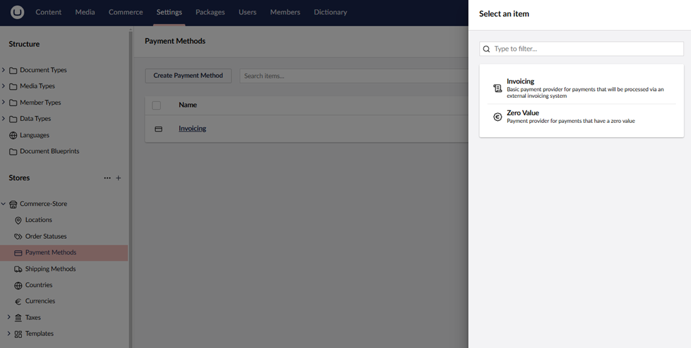

# Configure Umbraco

This article provides detailed instructions on configuring Umbraco to use the Zero payment method with your Umbraco Commerce implementation.

## Step 1: Create a Payment Method

To create Zero as a payment method, follow these steps:

1. Navigate to **Settings > Stores > {Store Name} > Payment Methods**.
2. Click **Create Payment Method**.
3. Select **Zero Value** from the list of available payment providers.

  
  
4. **Enter a Name** for the payment method. For example: *Zero Payment*.
5. Enter a value for **SKU**.
6. Click **Save**.

## Step 2: Configure Payment Provider Settings

To configure the Zero Payment Provider settings, follow these steps:

1. Navigate to **Settings > Stores > {Store Name} > Payment Methods**.
2. Select *Zero Payment*.
3. Choose the appropriate **Tax Class** from the dropdown menu.
4. Enter the **Default Pricing**.
5. Enter the URL of the page in the **Continue URL** field where users should be redirected after completing their payment. For example: `https://www.yourwebsite.com/confirmation`.
6. Choose the countries where the payment method should be available.
7. Click **Save**.
